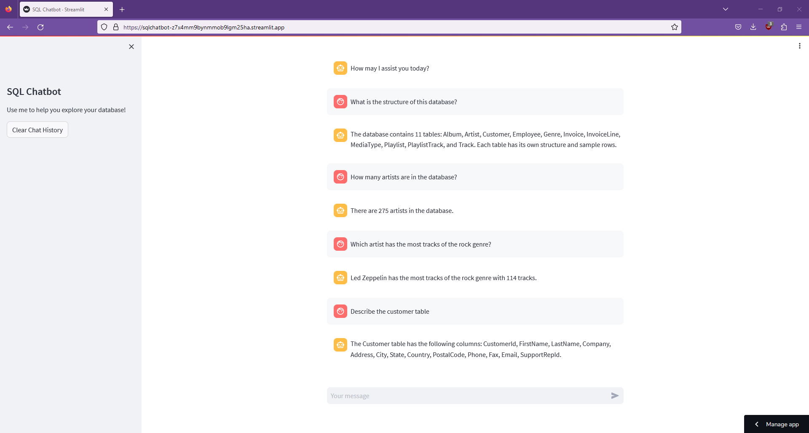

# SQL Chatbot

This chatbot is designed to help query a SQL database using natural language. It is powered by OpenAI and Langchain and deployed on Streamlit.
The chatbot can be accessed [here](https://sqlchatbot-z7x4mm9bynmmob9lgm25ha.streamlit.app/).
 
The repo contains a .sql file used to generate the sample Chinook database used in the bot.

## Demo
This is what the chatbot looks like in action:
 

## Limitations
The current live version does not have functional memory (i.e. it does not remember previous questions or responses). At this point, I have gotten an updated version with memory working in a notebook (as shown in the chatbot_memory_testing.ipynb file), but have not been able to get the v2 chatbot working properly when deployed on Streamlit.